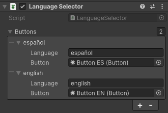

# Simple Unity Translation Package
A small and simple package that I use for translating text in Unity.

Here is a small introduction on how to use the package. Read the code to learn the full functionality.

---

## Add translation to the dictionary

Add a ``CsvTranslationReader`` component to the scene with all the translation files you want. This will add the content of the files to the translation dictionary at ``Awake`` time.


The CSV translation files should be formated as follows:

|  | language1 | language2 |
| --- | --- | --- |
| id1 | Hola Mundo! | Hello world! |
| id2 | (...) | (...) |

Languages and ids are case-insensitive. ``Español``, ``ESPAÑOL`` and ``español`` are all the same.

It is sensitive to accents and other special characters. ``Ingles`` and ``Inglés`` will be considered different languages.

Ids can only appear only once across all translation files. But languages can appear once on each file. The language columns can be in a different order for each file.

## Get translated text from the dictionary

Get translated text thas has been added to dictionary by doing:
````C#
string translatedText = TranslationDictionary.GetTranslation("textId");
````

## Translated Text component

The package includes components to automatically translate text for both TextMeshPro and the legacy Text component. This will show the text with the Id indicated in the inspector translated to the language selected in the dictionary.


## Change selected language

To manually change the globally selected language

````C#
TranslationDictionary.CurrentLanguage = "newlanguage";
````

This will automatically translate all text using the Translated Text components and fire an event that you can subscribe to by doing

````C#
TranslationDictionary.AddListenerToLanguageChange(OnLanguageChanged);
protected virtual void OnLanguageChanged(string newLanguage)
{
    // ...
}
````

## Language Selector component

The language selector component allows to automatically change the language when pressing a UI button.



## And that's it!

As far as localization goes, this is a really simple solution. It doesn't change the UI layout to accommodate languages read in different directions, nor does it have translated audio functionality, for example.

But it is a simple plug-and-play system that I find useful for game jams and small projects.

---

# Useful links
More about the CSV format:

- [CSV Basic Rules on Wikipedia](https://en.wikipedia.org/wiki/Comma-separated_values#Basic_rules)

---

# More

And check my own games using this little package:

- [On my Portfolio](http://s-lucasserrano.github.io/Portfolio/)
- [On my Itch.io page](https://lucasserrano.itch.io/)